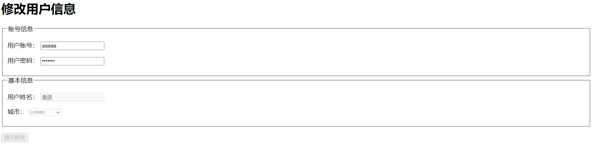
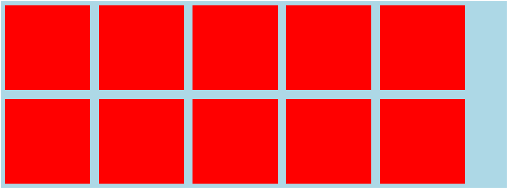

# 第一个网页

Emmet插件：自动生成HTML代码片段

## 注释

注释为代码的阅读者提供帮助，注释不参与运行

在HTML中，主要使用如下格式书写：

```html
<!-- 注释内容，可以写多行 -->
```

## 元素

> 其他叫法：标签、标记

```html
<a href="http://www.duyiedu.com">超链接</a>
```

整体：element（元素）

元素 = 起始标记（begin tag）+ 结束标记（end tag）+ 元素内容 + 元素属性（不是必须要写，是描述元素的一些额外信息）

属性 = 属性名 + 属性值

属性的分类：

- 局部属性：某些元素特有的属性

- 全局属性：所有元素通用

```html
<meta charset="UTF-8">
```

有些元素没有结束标记，这样的元素叫做： **空元素**

空元素的两种写法：

1. ```<meta charset="UTF-8">```
2. ```<meta charset="UTF-8" />```

## 元素的嵌套

元素不能相互嵌套

父元素，子元素，祖先元素，后代元素，兄弟元素

## 标准的文档结构

HTML：页面，HTML文档

```html
<!DOCTYPE html>
```

文档声明：告诉浏览器，当前文档使用的HTML标准是HTML5.

不写文档声明，将导致浏览器进入怪异渲染模式。

```html
<html lang="en"> </html>
<html lang="cmn-hans"> </html>简体中文的官方语言
```

根元素：一个页面最多只能有一个，是其他元素的父元素或者祖先元素

HTML5版本中没有强制要求书写该元素

lang属性：language全局属性，表示该元素内部使用的文字是使用哪一种自然语言书写而成的。

```html
<head>

</head>
```

文档头，文档头内部的内容，不会显示到页面上。

```html
<meta>
```

文档的元数据：附加信息。

charset：指定网页内容编码。

UTF-8 是Unicode编码

网页标题：

```html
<title>Document</title>
```

文档体：页面上所有要参与显示的都在文档体里。

```html
<body></body>
```

# 语义化

## 什么是语义化

1. 每一个HTML元素都有具体的含义

   a元素：超链接
   p元素：段落
   h1元素：一级标题

2. 所有元素与展示效果无关

   元素展示到页面中的效果，应该由css决定

   浏览器带有默认的css样式，所以每个元素有一些默认样式

<u>**重要：选择什么元素，取决于内容的含义，而不是显示出的效果**</u>

## 为什么需要语义化

1. 为了搜索引擎优化（SEO）
   
   搜索引擎：百度、Bing、Google

   每隔一段时间，搜索引擎会从整个互联网中，抓取页面源代码

2. 为了让浏览器理解网页

# 文本元素

HTML5中支持的元素：HTML5元素周期表

## h

标题：head

h1~h6：表示一级标题到六级标题

## p

段落：paragraphs

> 乱数假文，没有任何实际含义的文字：lorem

## span 【无语义】

没有语义，仅用于设置样式

> 以前：某些元素在显示时会独占一行（块级元素），而某些元素不会（行级元素）
> 到了HTML5，已经弃用这种说法

## pre

预格式化文本元素

空白折叠：在源代码中的连续空白字符（空格、换行、制表），在页面显示时，会被折叠为一个空格

例外：在pre元素中的内容不会出现空白折叠

在pre内容出现的内容，会按照源代码格式显示在页面上。

该元素通常用于在网页上显示一些代码

pre元素功能的本质：它有一个默认的css属性

> 显示代码是，通常外面套code元素，code表示代码区域

# HTML实体

实体字符：HTML Entity

实体字符通常用于在页面中显示一些特殊符号

1. &单词;
2. &#数字;


- 小于符号

> &lt;
> &#60;

- 大于符号

> &gt;


- 空格

> &nbsp;

- 版权符号

> &copy;

- &符号

> &amp;

# a元素

超链接

## href属性

hyper reference（引用）：通常表示跳转地址

1. 跳转地址：普通链接

2. 跳转某个锚点：锚链接

   ```html
   <a href="#first">章节1</a>
       <a href="#second">章节2</a>
       <a href="#tree">章节3</a>
       <a href="#four">章节4</a>
       <a href="#five">章节5</a>
       <a href="#six">章节6</a>
   
       <h2 id="first">章节1</h2>
       <p>Lorem ipsum, </p>
       <h2 id="second">章节2</h2>
       <p>Distinctio optio at reprehenderit id numquam, ipsum </p>
       <h2 id="tree">章节3</h2>
       <p> ipsa voluptatem! Numquam iure hic, repellat veritatis dolorem atque eius incidunt corrupti.</p>
       <h2 id="four">章节4</h2>
       <p>amet culpa. Voluptatem rerum natus ex voluptate. Nihil!</p>
       <h2 id="five">章节5</h2>
       <p>Commodi perspiciatis soluta porro! Facere, quod?</p>
       <h2 id="six">章节6</h2>
       <p>nemo ipsam ipsum maxime deserunt facere quaerat impedit, quo eius eaque veniam rerum.</p>
   ```

   id属性：全局属性，表示元素在文档中的唯一编号

3. 功能链接

   点击后，触发某个功能

- 执行js代码，javascript:

- 发送邮件，mailto

- 拨号：tel：要求计算机上安装拨号软件

  ```html
  <a href="javascript:alert('你好')">aa</a>
  <a href="mailto:503719582@qq.com">发送邮件</a>
  <a href="tel:17752405262">打电话</a>
  ```

## target属性

表示跳转窗口位置

target取值：

- _self：在当前页面窗口中打开，默认值

- _blank:在空白窗口中打开

  ```html
  <a href="http://www.baidu.com" target="_blank">
          百度
  </a>
  ```

  

# 路径写法

## 站内资源和站外资源

站内资源：当前网站的资源

站外资源：非当前网站的资源

## 绝对路径和相对路径

站外资源：绝对路径

站内资源：相对路径

1. 绝对路径

   绝对路径的书写格式：

   url地址：

```
协议名：//主机名：端口号/路径

schema://host:post
```

​			协议名：http、https、file

​			主机名：域名、ip地址

​			端口号：如果协议是http协议，默认端口号80；如果协议是https，默认端口为443

​			当跳转目标和当前页面的协议相同时，可以省略协议

2. 相对路径

   以./开头， ./表示当前资源所在目录

   可以书写../表示返回上一级目录

   相对路径中，./可以省略

# 图片元素

## img元素

image缩写，空元素

src属性：source，即图片的地址

alt属性：当图片资源失效时，将使用该属性描述这一张图片

## 和a元素联用

## 和map元素

map：地图

map的子元素：area

衡量坐标时，为了避免衡量误差，需要使用专业的衡量工具：

ps，pxcooke，cutpro

## 和figure元素

指代、定义，通常用于吧图片、图片标题，描述包裹起来

子元素：figcaption

# 多媒体元素

video 视频

audio 音频

## video

controls：控制控件的显示，取值只能为controls

某些属性，只有两种状态：1.不写 2. 取值为属性名，这种属性叫做布尔属性

布尔属性在HTML5中，可以不用书写属性值

autoplay：自动播放，布尔属性

muted：布尔属性，静音播放

loop：布尔属性，循环播放

## audio

和视频完全一致

## 兼容性

1. 旧版本的浏览器不支持这两个元素
2. 不同的浏览器支持的音视频格式可能不一致

MP4，webm

# 列表元素

## 有序列表

ol：ordered list

li：list item

## 无序列表

把ol改成ul

ul:undered list

无需列表常用于制作菜单 或 新闻列表。

## 定义列表

通常用于一些属于的定义

dl：definition list

dt：definition title

dd：definition description

# 容器元素

容器元素：该元素代表一块区域，内部用于放置其他元素

## div元素【没有语义】

## 语义化容器元素

header：通常用于表示页头，也可以用于表示文章的头部

footer：通常用于表示页脚，也可以用于表示文章的尾部

article：通常用于表示整篇文章

section：通常用于表示文章的章节

aside：通常用于表示侧边栏

# 元素包含关系

以前：块级元素可以包含行级元素，行级元素不可以包含块级元素，a元素除外

现在：元素的包含关系由元素的内容类别决定。

例如，查看h1元素中是否可以包含p元素

总结：

1. 容器元素中可以包含任何元素
2. a元素中几乎可以包含任何元素
3. 某些元素有固定的子元素，ul，ol>li，dl>dt+dd
4. 标题元素和段落元素不能相互嵌套，并且不能包含容器元素

# 为网页添加样式

## 术语解释

```css
h1 {
        color: red;
        background-color: aqua;
        text-align: center;
    }
```

css规则 = 选择器 + 声明块

### 选择器

选择器：选中元素

1. ID选择器：选中的是对应id值的元素
2. 元素选择器：选择对应的元素
3. 类选择器：

### 声明块

出现在大括号中

声明块中包含很多声明（属性），每一个声明（属性）表达了某一方面的样式

## css代码书写位置

1. 内部样式表

   书写在style**元素**中

2. 内联样式表，元素样式表

   直接书写在元素的style**属性**中

3. 外部样式表[推荐]

   将样式书写到独立的css文件中

   1). 外部样式可以解决多个样式重复的问题
   2). 有利于浏览器缓存，从而提高页面响应速度
   3). 有利于代码分离（HTML，css），更容易阅读和维护

# 常见样式声明

1. color

   元素内部的文字颜色

   **预设值**：定义好的单词

   **三原色，色值**：光学三原色（红，绿，蓝）

```
rgb表示法：
rgb(0,255,255)
hex（16进制）表示法：
#008c8c
```

​			淘宝红：#ff4400
​			黑色：#000
​			白色：#fff
​			灰色：#ccc

2. background-color

   元素背景颜色

3. font-size

   元素内部的文字尺寸大小

   1) px：像素，绝对单位，简单的理解为文字的高度占多少个像素
   2) em：相对单位，相对于父元素的字体大小
   每个元素必须有字体大小，如果没有声明，则使用父元素的字体大小，如果没有父元素，则使用基准字号。

> user agent, UA,用户代理（浏览器）

4. font-weight

   文字粗细程度，可以取值数字，可以取值为预设值

   bold：加粗。

   normal：默认值，不加粗。

> strong元素，默认是加粗

1. font-family

   文字类型

   可以取值本机自有的字体：必须用户电脑中带有某种字体才可以显现

   使用多个字体，以匹配不同的环境

   sans-serif，非衬线字体

2. font-style

   字体样式，通常用它设置斜体：italic

> i元素,em元素：默认是倾斜字体；实际使用中，通常用它表示一个图标（icon）

7. text-decoration

   文本修饰，给文本加线。

> none:没有下划线

> line-through:中间穿过的一条线

> overline：上边加一条线

> underline：下边加一条线

> a元素：自己有下划线
> del元素：错误的内容（中间穿过一条横线）
> s元素：过期的内容

8. text-indent

   首行文本缩进

```css
text-indent: 2em; 
中文刚好缩进2个字
英文可能不一定是2个字 
```

9. line-height

   每行文本的高度，该值越大，每行文本的距离越大

   设置行高为容器的高度，可以让单行文本垂直居中

> 当height == line-height时，就会使单行文本垂直居中
> 行高可以设置为纯数字，表示相对于元素的字体大小

10. width

    元素宽度

11. height

    元素高度

12. letter-space

    文字间隙

> letter-space: 值为像素值

13. text-align

    元素内部文字的水平排列方式

```css
text-align: left(默认值)
text-align：center（居中），right（靠右）
```

# 选择器

选择器：帮助我们精准的选中想要的元素

## 简单选择器

1. ID选择器
2. 元素选择器
3. 类选择器
4. 通配符选择器

*：选中所有元素

5. 属性选择器

根据属性名和属性值选择元素

> [attr |=value]:属性名为attr，属性值以“value"或是以"value-"为前缀开头
> [attr^=value]:属性名为attr，属性值是以"value"开头的元素
> [attr$=value]:属性名为attr，属性值以"value"结尾的元素
> [attr*=value]:属性名为attr，属性值包含"value"的元素

6. 伪类选择器

选中某些元素的某种状态

> hover：鼠标移入的状态/悬停的状态

写法：

```css
元素：hover {
    .....
}
```

> active：激活状态，鼠标按下状态

写法：

```css
元素：active {
    .....
}
```

> link:超链接未访问过的状态

> visited：超链接访问过后的状态
> 顺序书写：link，visited，hover，active  爱恨法则：love hate

7. 伪元素选择器

生成并选中某个元素内部的第一个子元素或最后一个子元素

> before

写法：

```css
元素:: before {
    content："";
}
```

> after

写法：

```css
元素:: after {
    content："";
}
```

## 选择器的组合

1. 并且

写法：

```css
p.red {...}
元素.类选择器
```

2. 后代元素 —— 空格

写法：

```css
.red li {...}
注意：<div class="red"></div>
```

3. 子元素 —— >

写法

```css
.red>li {...}
注意：<div class="red"></div>
```

4. 相邻兄弟元素 —— +

写法

```css
.special+li {
    color: navajowhite;
}
```

5. 后边出现的所有兄弟元素 —— ~

写法

```css
.special~li {
    color: yellowgreen;
}
```

## 选择器的并列

多个选择器，用逗号分隔

语法糖：不会改变本质，方便我们记忆

# 层叠

声明冲突：同一个样式，都应用到了同一个元素

层叠：解决声明冲突的过程，浏览器自动处理（权重计算）

## 1. 比较重要性

重要性从高到低：

> 作者样式表：开发者书写的样式

1) 作者样式表中的 !important样式
2) 作者样式表中的普通样式
3) 浏览器默认样式表中的样式

## 2. 比较特殊性

看选择器

总体规则：选择器选中的范围越窄，越特殊

具体规则：通过选择器，计算出一个4位数

1. 千位：如果是内联样式，记作1，否则记作0
2. 百位：等于选择器中所有id选择器的数量
3. 十位：等于选择器中所有类选择器，属性选择器，伪类选择器的数量
4. 个位：等于选择器中所有元素选择器，伪元素选择器的数量

## 3. 比较源次序

代码书写靠后的胜出

## 应用

1. 重置样式表

书写一些作者样式，覆盖浏览器的默认样式

重置样式表覆盖掉浏览器的默认样式表

常见的重置样式表：normalize.css， reset.css，meyer.css

2. 爱恨法则

link > visited > hover > active

# 继承

子元素会继承父元素的某些css属性

通常，跟文字内容相关的属性都能被继承

> color font-weight font-size line-height font-family text-align

# 属性值的计算过程

一个元素一个元素一次渲染，顺序按照页面文档的树形目录结构进行

渲染每个元素的前提条件：该元素的所有css属性必须有值

一个元素，从所有属性都没有值，到所有的属性都有值，这个计算过程，叫做属性值计算过程

特殊的两个css取值：

- inherit：手动（强制）继承，将父元素的值取出应用到该元素
- initial：初始值，将该属性设置为默认值

# 盒模型

box：盒子，每个元素在页面中都会生成一个矩形区域（盒子）

盒子类型：

1. 行盒：display=inline的元素
2. 块盒：display=block的元素

行盒在页面中不换行，块盒独占一行

display默认值为inline

浏览器默认样式表设置的块盒：容器元素，h1~h6，p

常见的行盒：span，a，img，video，audio

## 盒子的组成部分

无论是行盒、还是块盒，都是有下面几个部分组成，从内到外分别是：

1. 内容：content

   width、height、设置的是盒子内容的宽高

   内容部分：通常叫做整个盒子的**内容盒 content-box**

2. 填充（内边距）：padding

   盒子边框到盒子内容的距离

   padding-left，padding-right，padding-top，padding-bottom

   padding：简写属性

   padding：top，right，bottom，left

   padding：top bototm， right left

   padding：top right bottom left

   padding：top，left right， bottom

   填充区+内容区 = **填充盒 padding-box**

3. 边框：border

   边框 = 边框样式 + 边框宽度 + 边框颜色

   边框样式：border-style：top， right，bottom，left

> solid(实线)，dashed（虚线），dotted（圆点）， double（双实线），groove（立体）

​				边框宽度：border-width

> border-width：top， right，bottom，left

​			边框颜色：border-color

​			border-color：top， right，bottom，left

​			边框+填充区+内容区 = **边框盒 border-box**

4. 外边距：margin

   边框到其他盒子的距离

   margin-top,margin-right,margin-bottom,margin-left

   margin:top， right，bottom，left

# 盒模型应用

## 改变宽高范围

默认情况下，width 和 height 设置的是内容盒宽高。

> 页面重构师：将psd文件（设计稿）制作为静态页面

衡量设计稿尺寸的时候，旺旺使用的是边框盒，但设置width和htight，则设置的是内容盒

解决办法：

1. 精确计算
2. css3：box-sizing：border-box； content-box

## 改变背景覆盖范围

默认情况下，背景覆盖边框盒

解决方法：

1. background-clip：border-box；content-box； padding-box

## 溢出处理

内容有时候会超过盒子区域

解决方法：

1. overflow：控制内容溢出边框盒后的处理方式；

> overflow:visible(默认可见)； hidden（溢出部分隐藏）；scroll（生成滚动条）；auto（自动）
> overflow-y:scroll;auto     overfloe-x:scroll; auto

## 断词规则

宽度显示不下时会进行换行

解决方法：

1. word-break:会影响文字在什么位置被截断换行

```css
word-break:normal；（普通，CJK字符，文字位置截断；费CJK字符，单词位置截断）
borak-all：截断所有。所有字符都在文字处截断； 
keep-all：保持所有。所有文字都在单词之间截断
```

## 空白处理

white-space： nowrap（不换行）
text-overflow：ellipsis；（三个点）

> 适用于单行文本

# 行盒的盒模型

常见的行盒：包含具体内容的元素

span、strong、em、i、img、video、audio

## 显著特点

1. 盒子沿着内容沿伸
2. 行盒不能设置宽高，宽高无效（取决于内容的大小）

> 调整行盒的宽高，应该使用字体大小，行高，字体类型，间接调整

3. 内边距（填充区）

> 水平方向有效，垂直方向只会影响背景，不会占据实际空间

4. 边框

> 水平方向有效，垂直方向只会影响背景不会实际占据空间

5. 外边距

> 水平方向有效，垂直方向会影响背景不会实际占据空间

## 行块盒

display：inline-block 的盒子

1. 不独占一行
2. 但盒模型只能怪所有尺寸都有效

## 空白折叠

空白折叠，发生在行盒（行块盒）内部 或 行盒（行块盒）之间

## 可替换元素 和 非可替换元素

大部分元素，页面上显示的结果，取决于元素内容，称为**非可替换元素**

少部分元素，页面上显示的结果，取决于元素属性，称为**可替换元素**

可替换元素：img，video，audio

绝大部分可替换元素均为行盒

可替换元素类似于行块盒，盒模型中的某些属性可以实现

# 常规流

盒模型：规定单个盒子的规则

视觉格式化模型（布局规则）：页面中的多个盒子排列规则

视觉格式化模型，大体上将页面中盒子的排列分为三种方式：

1. 常规流
2. 浮动
3. 定位

## 常规流布局

常规流、文档流、普通文档流、常规文档流

所有元素默认情况下，都属于常规流布局；

总体规则：块盒独占一行，行盒水平依次排列

包含块（containing block）：每个盒子都有它的包含块，包含块决定了盒子的排列区域；

绝大部分情况下：盒子的包含块，为其父元素的内容盒

**块盒**

1. 每个块盒的总宽度，必须刚好等于包含块的宽度

宽度的默认值是auto

margin的取值也可以为auto，但是默认值为0

auto：将剩余空间吸收掉

width吸收能力强于margin

若宽度、边框、内边距、外边距计算后，仍然有剩余空间，该剩余空间被margin-right全部吸收

在常规流中，块盒在其包含块中居中，可以定宽、然后左右margin设置为auto

2. 每个块盒垂直方向上的auto值

height：auto，适应内容的高度

margin：auto，表示0

3. 百分比取值

padding、宽、margin可以取值为百分比

以上所有百分比相对于包含块的宽度

高度的百分比：

1) 包含块的高度是否取决于子元素的高度：这种情况设置百分比无效
2) 包含块的高度不取决于子元素的高度：百分比相对于父元素

4. 上下外边距的合并

两个
常规流块盒，上下两个margin相邻会进行合并

两个外边距取最大值

 # 浮动

 视觉格式化模型，大体上将页面中盒子的排列分为三种方式：

  1. 常规流
  2. 浮动
  3. 定位

## 应用场景

1. 文字环绕
2. 横向排列

## 浮动的基本特点

修改float属性值为：

- left：左浮动，元素靠左考上
- right：右浮动，元素靠上靠右

默认值为none

1. 当一个元素浮动后，元素必定为块盒（更改display属性为block）
2. 浮动元素的包含块和常规流一样，为父元素的内容盒

## 盒子尺寸

1. 宽度为auto时，适应内容宽度

   ```css
   <style>
           .container {
               width: 500px;
               height: 500px;
               background:lightblue;
           }
           .container div {
               width: auto;
               height: 50%;
               background:red;
           }
           .container .left {
               float:left;
           }
           .container .right {
               float:right;
           }
       </style>
   </head>
   <body>
       <div class="container">
           <div class="left">Lorem ipsum dolor sit.</div>
           <div class="right">Lorem ipsum dolor sit amet consectetur.</div>
       </div>
   ```

   

2. 高度为auto时，与常规流一致，适用内容的高度

3. margin为auto时，为0

4. 边框、内边距、百分比设置与常规流一样

## 盒子排列

1. 左浮动的盒子靠上靠左排列

2. 右浮动的盒子靠右靠上排列

3. 浮动盒子在包含块中排列时，会避开常规流块盒

   

4. 常规流块盒在排列时，无视浮动盒子

   

5. 行盒在排列时，会避开浮动盒子

   

> 如果文字没有在行盒中，浏览器会直接生成一个行盒包裹文字，该行盒家叫做**匿名行盒**

6. 外边距合并不会发生

## 高度坍塌

原因：常规流盒子的自动高度，在计算时不会考虑浮动盒子


解决方案：清楚浮动，涉及css属性：clear

- 默认值： none

- left：清楚左浮动，该元素必须出现在前面所有左浮动盒子的下方

- right：清除右浮动，该元素必须出现在前面所有右浮动盒子的下方

方案1 

  ```css
  <style>
          .container {
              /* height: 100px; */
              padding: 30px;
              background: lightblue;
          }
  
          .container .item {
              width: 100px;
              height: 100px;
              background: red;
              margin: 6px;
              float: left;
          }
          .container .clearfix {
              clear: both;
          }
      </style>
  </head>
  <body>
      <div class="container">
          <div class="item"></div>
          <div class="item"></div>
          <div class="item"></div>
          <div class="item"></div>
          <div class="item"></div>
          <div class="item"></div>
          <div class="item"></div>
          <div class="item"></div>
          <div class="item"></div>
          <div class="item"></div>
          <div class="clearfix"></div>
      </div>
  ```

  

方案2

```css
<style>
        .container {
            /* height: 100px; */
            padding: 30px;
            background: lightblue;
        }

        .container .item {
            width: 100px;
            height: 100px;
            background: red;
            margin: 6px;
            float: left;
        }
        .clearfix::after{
            content: "";
            display: block;
            clear: both;
        }
    </style>
</head>
<body>
    <div class="container clearfix">
        <div class="item"></div>
        <div class="item"></div>
        <div class="item"></div>
        <div class="item"></div>
        <div class="item"></div>
        <div class="item"></div>
        <div class="item"></div>
        <div class="item"></div>
        <div class="item"></div>
        <div class="item"></div>
    </div>
```

# 定位

 视觉格式化模型，大体上将页面中盒子的排列分为三种方式：

  1. 常规流
  2. 浮动：float
  3. 定位：position

定位：手动控制元素在包含块中的精准位置

涉及的css属性：position

## position属性

- 默认值：static，静态定位（不定位）
- relative：相对定位
- absoult：绝对定位
- fixed：固定定位

一个元素，只要position的取值不是static，认为该元素是一个定位元素

定位元素会脱离文档流（相对定位除外）

一个脱离了文档流的元素：

1. 文档流中的元素摆放时，会忽略脱离了文档流的元素
2. 文档流中元素计算自动高度时，会忽略脱离了文档流的元素

## 相对定位

不会导致元素脱离文档流，只是让元素在原来的位置上进行偏移。

可以通过四个css属性对设置其位置：

- left
- right
- top
- bottom

盒子的偏移不会对其他盒子造成任何影响

> left 和margin-left的区别：当两个盒子的宽度为自适应时，left是相对于盒子刚才的位置进行偏移；而设置margin-left属性的这个盒子会移动，但是自身宽度有变化；
> 

## 绝对定位

1. 宽高为auto，适应内容
2. 包含块变化：找祖先元素中第一个定位元素，该元素的填充盒为其包含块.若找不到，则它的包含块为整个网页（初始化包含块）

## 固定定位

其他情况和绝对定位完全一样。

包含块不同：固定为视口（浏览器的可视窗口）

## 定位下的居中

某个方向居中：

1. 定宽（高）
2. 将左右（上下）距离设置为0
3. 将左右（上下）margin设置为auto

绝对定位和固定定位中，margin为auto时，会自动吸收剩余空间

## 多个定位元素重叠时

堆叠上下文

设置z-index，通常情况下，该值越大，越靠近用户

只有定位元素设置z-index有效

z-index可以是负数，如果是负数，则遇到常规流、浮动元素、则会被其覆盖

## 补充

- 绝对定位、固定定位元素一定是块盒
- 绝对定位、固定定位一定不是浮动
- 没有外边距合并

## 透明

每个颜色都具有透明通道，0~1

1. rgba(红，绿，蓝，alpha)
2. hex：#红绿蓝透

# 更多的选择器

## 更多伪类选择器

1. first-child

选择第一个子元素

first-of-type

2. last-child

选择最后一个子元素

3. nth-child

选中指定的第几个子元素

even：关键字，等同于2n
odd：关键字，等同于2n+1

4. nth-of-type

选中指定的子元素中第几个某类型的元素

## 更多的伪元素选择器

1. first-letter

选中元素中的第一个字母

2. first-line

选中元素中第一行的文字

3. selection

选中被用户框选的文字

# 更多的样式

## 透明度

1. opacity,他设置的是整个元素的透明度，他的取值是0~1
2. 在颜色位置设置alpha通道（rgba）

## 鼠标

cursor：pointer

> 插入指定图片作为鼠标样式：cursor:url(),auto;

## 盒子隐藏

1. display：none；不生成盒子
2. visibility：hidden；生成盒子，只是从视觉上移除盒子，盒子仍然占用空间

## 背景图

### 和img元素的区别

img元素属于html的概念

背景图属于css的概念

1. 当图片属于网页内容时，必须使用img元素
2. 当图片仅用于美化页面时，必须使用背景图

### 涉及的css属性

1. background-image：背景图片

2. background-repeat：默认情况下，背景图会在横坐标和纵坐标中进行重复

```css
background-repeat:repeat (默认)平铺；no-repeat不平铺
```

3. background-size:背景图片大小

预设值：

```css
background-size:contain(图片完整的显示) ; cover (图片充满区域，比例不变)
```

百分比或数值：

```css
background-size: 100%（表宽度填充满，高度自适应）； 300px 200px；
```

4. background-position：背景图片位置

预设值：left、bottom、right、top、center

```css
background-position:center (横向纵向居中)；center top（横向居中，纵向靠上）； right bottom（横向靠右，纵向考下）
```

百分比或者数值

雪碧图（精灵图）：spirit

> 所谓雪碧图，就是多个图片在一张图中，有利于提高运行速度

5. background-attachment:通常用于控制背景图是否固定

6. 背景颜色和背景图混用

```css
background-attachment: fixed;
background-color: #000;
```

7. 速写属性background

```css
background: background-image background-repeat  background-posiziton / background-size  background-attachment
```

# iframe元素

框架页

通常用于在网页中嵌入另一个页面

iframe 可替换元素

1. 通常行盒
2. 通常显示的内容取决于元素的属性
3. CSS不能完全控制其中的样式
4. 具有行快盒的特点
```html
<body>
    <a href="https://www.baidu.com" target="myframe">百度</a>
    <a href="https://douyu.com" target="myframe">斗鱼</a>
    <a href="https://www.taobao.com" target="myframe">淘宝</a>

    <iframe name="myframe" src="https://www.baidu.com"></iframe>
</body>
```


# 在页面中使用flash

object

embed

它们都是可替换元素

MIME(Multipurpose Internet Mail Extensions)

多用途互联网邮件类型：

比如，资源是一个jpg图片，MIME：image/jpeg

```html
<object data="./example.swf" type="application/x-shockwave-flash">
        <param name="quality" value="high">
        <embed quality="high" src="./example.swf" type="application/x-shockwave-flash">
</object>
```


# 表单元素

一系列元素，主要用于收集用户数据

## input元素

输入框

- type属性：输入框类型

type: text， 普通文本输入框
type：password，密码框
type: date, 日期选择框，兼容性问题
type: search, 搜索框，兼容性问题
type: number，数字输入框
type: checkbox，多选框
type: radio，单选框

- value属性：输入框的值
- placeholder属性：显示提示的文本，文本框没有内容时显示


input元素可以制作按钮

当type值为reset、button、submit时，input表示按钮。

## select元素

下拉列表选择框

通常和option元素配合使用

```html
<select name="" id="">
    <option value="">西安</option>
    <option value="">银川</option>
    <option value="">成都</option>
    <option value="">北京</option>
  </select>
```

## textarea元素

文本域，多行文本框

## 按钮元素

button

type属性：reset、submit、button，默认值submit

## 表单状态

readonly属性：布尔属性，是否只读，不会改变表单显示样式

disabled属性：布尔属性，是否禁用，会改变表单显示样式

## 配合表单元素的其他元素

### label

普通元素，通常配合单选和多选框使用

- 显示关联

可以通过for属性，让label元素关联某一个表单元素，for属性书写表单元素id的值

- 隐式关联

```html
请选择性别：
  <input type="radio" name="sex" id="radMal">
  <label for="radMal">男</label>

  <input type="radio" name="sex" id="radFemal">
  <label for="radFemal">女</label>
```

### datalist

数据列表

该元素本身不会显示到页面，通常用于和普通文本框配合

```js
<p>
    <input type="text" list="userAgent">
  </p>

  <datalist id="userAgent">
    <option value="Chrome">谷歌浏览器</option>
    <option value="IE">IE浏览器</option>
    <option value="Opera">欧朋浏览器</option>
    <option value="Safari">苹果浏览器</option>
  </datalist>
```


### form元素

通常，会将整个表单元素，放置form元素的内部，作用是当提交表单时，会将form元素内部的表单内容以合适的方式提交到服务器。

form元素对开发静态页面没有什么意义。

### fieldset元素

表单分组

```html
    <div>
        <h1>修改用户信息</h1>
        <fieldset>
            <legend>账号信息</legend>
            <p>
                用户账号：
                <input type="text" value="aaaaa" readonly>
            </p>
            <p>
                用户密码：
                <input type="password">
            </p>
        </fieldset>

        <fieldset>
            <legend>基本信息</legend>
            <p>
                用户姓名：
                <input disabled value="袁进" type="text">
            </p>
            <p>
                城市：
                <select disabled name="" id="">
                    <option value="">Lorem.</option>
                    <option value="">Vel!</option>
                    <option value="">Dolore?</option>
                    <option value="">Autem?</option>
                    <option value="">Nulla?</option>
                    <option value="">Aliquam?</option>
                    <option value="">Obcaecati!</option>
                    <option value="">Nulla!</option>
                    <option value="">Totam.</option>
                    <option value="">Ipsum.</option>
                </select>
            </p>
        </fieldset>
```



# 美化表单元素

## 新的伪类

1. focus

元素聚焦时的样式

2. checked

单选或多选框被选中的样式

## 常见用法

1. 重置表单元素样式

2. 设置textarea是否允许调整尺寸

css属性resize：

- both：默认值，两个方向都可以调整尺寸
- none：不能调整尺寸
- horizontal: 水平方向可以调整尺寸
- vertical：垂直方向可以调整尺寸

3. 文本框边缘到内容的距离

4. 控制单选和多选的样式


# 表格元素

在css技术出现之前，网页通常使用表格布局。

后台管理系统中可能会使用表格。

前台：面向用户

后台：面向管理员。对界面要求不高，对功能性要求高。

表格不再适用于网页布局？表格的渲染速度过慢。


# 其他元素

1. abbr

缩写词

```html
<p>
   <abbr title="cascading style sheet">CSS</abbr> 是用于为页面添加样式
</p>
```

2. time

提供给浏览器或搜索引擎阅读的时间

```html
<p>
   <time datetime="2019-5-1">今年5月</time>
   我录制了HTML 和 CSS的课程
</p>
```

3. b  （bold）

以前是一个无语义元素，主要用于加粗字体

```html
<p>
   我们学校有两个课程非常受欢迎，<b>HTML&CSS</b> 和 <b>JS</b>
</p>
```

4. q

一小段引用文本

```html
<p>
   最近热播的美剧《权力的游戏》中有一句经典台词：<q>在权力的斗争中，非胜即死，没有中间状态</q>
</p>
```

5. blockquote

大段引用的文本

```html

<blockquote cite="https://developer.mozilla.org/en-US/docs/Web/HTML/Element/blockquote">
   The HTML &lt;blockquote&gt; Element (or HTML Block Quotation Element) indicates that the enclosed text is an extended
   quotation. Usually, this is rendered visually by indentation (see Notes for how to change it). A URL for the source
   of the quotation may be given using the cite attribute, while a text representation of the source can be given using
   the &lt;cite&gt; element.
</blockquote>
```

6. br

无语义
主要用于在文本中换行

7. hr

无语义
主要用于分割

8. meta

还可以用于搜索引擎优化（SEO）

```html

<meta charset="UTF-8">
<meta name="viewport" content="width=device-width, initial-scale=1.0">
<meta http-equiv="X-UA-Compatible" content="ie=edge">
<meta name="keywords" content="在线商城,美容,微整形">
<meta name="author" content="yuanjin,sdfasdfadf@qq.com">
<meta name="description" content="asdfasdf asfasfasd fasf asd fsd sa f">
```

9.  link

链接外部资源（CSS、图标）

rel属性：relation，链接的资源和当前网页的关系

type属性：链接的资源的MIME类型

```html
link rel="stylesheet" type="text/css" href="test3.css">
<link rel="shortcut icon" type="image/x-icon" href="favicon.ico">
```


# @规则

at-rule:@规则、@语句、@指令、css语句

1. import

@import "路径"；

导入另外一个css文件


2. charset

@charset "utf-8";

告诉浏览器css文件，使用的字符编码集是utf-8，必须写到第一行;


# web字体和图标

## web字体

解决用户电脑上没有安装相应字体的问题，强制让用户下载该字体

使用@font-face制作一个新字体

```html
<!DOCTYPE html>
<html lang="en">
<head>
    <meta charset="UTF-8">
    <title>web字体</title>
    <style>
        @font-face {
            font-family: "good night";
            src: url("font/晚安体.ttf");
        }
        p {
            font-family: "good night";
        }
    </style>
</head>
<body>
<p>
    中文文文文文
</p>
</body>
</html>
```

## 字体图标

网址：iconfont.cn


# 块级格式化上下文BFC


作用：

- 创建BFC的元素，它的自动高度需要计算浮动元素

```html
<!DOCTYPE html>
<html lang="en">
<head>
    <meta charset="UTF-8">
    <title>test1</title>
    <style>
        .container {
            background: lightblue;
            /*
            使用BFC解决高度坍塌，只需要给BFC区域设置以下三种方法即可：
            1. display: position;
            2. float:left;
            3.overflow:hidden/scroll/auto;
            */
            overflow: hidden;
        }

        .item {
            width: 200px;
            height: 200px;
            background: red;
            float: left;
            margin: 10px;
        }

        /*这是以往我们解决子元素浮动，父元素高度坍塌的方法*/
        /*.clearfix::after {*/
        /*    content: "";*/
        /*    display: block;*/
        /*    clear: both;*/
        /*}*/
    </style>
</head>
<body>
<div class="container clearfix">
    <div class="item"></div>
    <div class="item"></div>
    <div class="item"></div>
    <div class="item"></div>
    <div class="item"></div>
    <div class="item"></div>
    <div class="item"></div>
    <div class="item"></div>
    <div class="item"></div>
    <div class="item"></div>
</div>
</body>
</html>

```


- 创建BFC的元素，它的边框不会和浮动元素重叠

```html
<!DOCTYPE html>
<html lang="en">
<head>
    <meta charset="UTF-8">
    <title>test2</title>
    <style>
        .float {
            width: 200px;
            height: 200px;
            background: red;
            margin: 20px;
            float: left;
        }
        .container {
            height: 300px;
            background: #008c8c;
            /*创建BFC区域*/
            overflow: hidden;
        }
    </style>
</head>
<body>
<div class="float"></div>
<div class="container"></div>
</body>
</html>

```


- 创建BFC的元素，不会和它的子元素进行外边距合并

```html
<!DOCTYPE html>
<html lang="en">
<head>
    <meta charset="UTF-8">
    <title>test3</title>
    <style>
        /*父元素和子元素外边距合并问题*/
        .parent {
            height: 500px;
            background: #008c8c;
            margin-top: 30px;
            /*创建BFC区域*/
            overflow: hidden;
        }

        .child {
            height: 100px;
            background: red;
            margin: 50px;
        }
    </style>
</head>
<body>
<div class="parent">
    <div class="child"></div>
</div>
</body>
</html>

```


# 行高的取值

```html
<head>
    <meta charset="UTF-8">
    <title>行高</title>
    <style>
        .container {
            /*行高为字体大小的2倍，先计算像素值，再继承*/
            line-height: 2em;

            /*行高为字体大小的2倍，先继承，在计算*/
            line-height: 2;
        }

        .p1 {
            font-size: 40px;
        }

        .p2 {
            font-size: 12px;
        }
    </style>
</head>
<body>
<div class="container">
    <p class="p1">Lorem ipsum dolor sit amet, consectetur adipisicing elit. Accusamus amet asperiores at, deleniti dolorem enim eos est hic in ipsam maiores minus non numquam optio quam reprehenderit rerum sunt voluptate.</p>
    <p class="p2">Lorem ipsum dolor sit amet, consectetur adipisicing elit. Accusantium aliquid aut commodi delectus deserunt, doloribus earum eos esse eum fuga impedit libero officiis reiciendis repellat soluta tenetur voluptatem! Autem, quidem?</p>
</div>
</body>
```


# body背景

**画布 canvas**

一块区域

特点：

1. 最小宽度为视口宽度
2. 最小高度为视口高度

**HTML元素的背景**

覆盖画布

**BODY元素的背景**

如果HTML元素有背景，BODY元素正常（背景覆盖边框盒）

如果HTML元素没有背景，BODY元素的背景覆盖画布

**关于画布背景图**

1. 背景图的宽度百分比，相对于视口
2. 背景图的高度百分比，相对于网页高度
3. 背景图的横向位置百分比、预设值，相对于视口
4. 背景图的纵向位置百分比、预设值，相对于网页高度


# 行盒的垂直对齐

## 多个行盒垂直方向上的对齐

给没有对齐元素设置vertical-align

预设值 

数值

> vertical-align只能在行盒中使用

## 图片的底部白边

图片的父元素是一个块盒，块盒高度自动，图片底部和父元素底边之间往往会出现空白。
当字体越大，底部百边就会越多

1. 设置父元素的字体大小为0
2. 将图片设置为块盒


# 参考线-深入理解字体

font-size、line-height、vertical-align、font-family

## 文字

文字是通过一些文字制作软件制作的，比如fontforge

制作文字时，会有几根参考线，不同的文字类型，参考线不一样。同一种文字类型，参考线一致。

## font-size

字体大小，设置的是文字的相对大小

文字的相对大小：1000、2048、1024

文字顶线到底线的距离，是文字的实际大小（content-area，内容区）

行盒的背景，覆盖content-area

## 行高

顶线向上延申的空间，和底线向下延申的空间，两个空间相等，该空间叫做gap（空隙）

gap默认情况下，是字体设计者决定

top到botoom（看ppt图），叫做virtual-area（虚拟区）

行高，就是virtual-area

line-height:normal，默认值，使用文字默认的gap

> 文字一定出现一行的最中间——错误
> content-area一定出现在virtual-area的中间

## vertical-align

决定参考线：font-size、font-family、line-height

一个元素如果子元素出现行盒，该元素内部也会产生参考线

baseline：该元素的基线与父元素的基线对齐

super: 该元素的基线与父元素的上基线对齐

sub：该元素的基线与父元素的下基线对齐

text-top: 该元素的virtual-area的顶边，对齐父元素的text-top

text-bottom: 该元素的virtual-area的底边，对齐父元素的text-bottom

top：该元素的virtual-area的定边，对齐line-box的顶边

bottom：该元素的virtual-area的底边，对齐line-box的底边

middle: 该元素的中线（content-area的一半），与父元素的X字母高度一半的位置对齐

行盒组合起来，可以形成多行，每一行的区域叫做line-box，line-box的顶边是该行内所有行盒最高顶边，底边是该行行盒的最低底边。

实际，一个元素的实际占用高度（高度自动），高度的计算通过line-box计算。

行盒：inline-box
行框：line-box

数值：相对于基线的偏移量，向上为正数，向下为负数。

百分比：相对于基线的偏移量，百分比是相对于自身virtual-area的高度

line-box是承载文字内容的必要条件，以下情况不生成行框：

1. 某元素内部没有任何行盒
2. 某元素字体大小为0

## 可替换元素和行块盒的基线

图片：基线位置位于图片的下外边距。

表单元素：基线位置在内容底边

行块盒：

1. 行块盒最后一行有line-box，用最后一行的基线作为整个行块盒的基线。
2. 如果行块盒内部没有行盒，则使用下外边距作为基线


# 堆叠上下文

堆叠上下文（stack context），它是一块区域，这块区域由某个元素创建，它规定了该区域中的内容在Z轴上排列的先后顺序。

## 创建堆叠上下文的元素

1. html元素（根元素）
2. 设置了z-index（非auto）数值的定位元素

## 同一个堆叠上下文中元素在Z轴上的排列

从后到前的排列顺序：

1. 创建堆叠上下文的元素的背景和边框
2. 堆叠级别(z-index, stack level)为负值的堆叠上下文
3. 常规流非定位的块盒
4. 非定位的浮动盒子
5. 常规流非定位行盒
6. 任何 z-index 是 auto 的定位子元素，以及 z-index 是 0 的堆叠上下文
7. 堆叠级别为正值的堆叠上下文

每个堆叠上下文，独立于其他堆叠上下文，它们之间不能相互穿插。


# svg

svg: scalable vector graphics，可缩放的矢量图

1. 该图片使用代码书写而成
2. 缩放不会失真
3. 内容轻量

## 怎么使用

svg可以嵌入浏览器，也可以单独成为一个文件

xml语言，svg使用该语言定义

## 书写svg代码

### 矩形:rect

### 圆形：circle

### 椭圆：ellipse

### 线条：line

### 折线：polyline

### 多边形：polygon

### 路径：path

M = moveto
L = lineto
H = horizontal lineto
V = vertical lineto
C = curveto
S = smooth curveto
Q = quadratic Belzier curve
T = smooth quadratic Belzier curveto
A = elliptical Arc

A
半径1    
半径2     
顺时针旋转角度    
小弧（0）或大弧（1）   
顺时针（1）逆时针（0）

Z = closepath


### 例子

画太极图


# 数据链接

data url

## 如何书写

数据链接：将目标文件的数据直接书写到路径位置

语法：data:MIME,数据

## 意义

优点：

1. 减少了浏览器中的请求

请求

响应

减少了请求中浪费的时间

2. 有利于动态生成数据

缺点：

1. 增加了资源的体积

导致了传输内容增加，从而增加了单个资源的传输时间

2. 不利于浏览器的缓存

浏览器通常会缓存图片文件、css文件、js文件。

3. 会增加原资源的体积到原来的4/3

应用场景：

1. 但请求单个图片体积较小，并且该图片因为各种原因，不适合制作雪碧图，可以使用数据链接。

2. 图片由其他代码动态生成，并且图片较小，可以使用数据链接。

## base64

一种编码方式

通常用于将一些二进制数据，用一个可书写的字符串表示。


# 浏览器兼容性

## 问题产生原因

- 市场竞争
- 标准版本的变化

## 厂商前缀

> 比如：box-sizing， 谷歌旧版本浏览器中使用-webkit-box-sizing:border-box

- 市场竞争，标准没有发布
- 标准仍在讨论中（草案），浏览器厂商希望先支持

IE： -ms-
Chrome，safari:  -webkit-
opera： -o-
firefox: -moz-

> 浏览器在处理样式或元素时，使用如下的方式：
> 当遇到无法识别的代码时，直接略过。


1. 谷歌浏览器的滚动条样式

实际上，在开发中使用自定义的滚动条，往往是使用div+css+JS实现的

2. 多个背景图中选一个作为背景

## css hack

根据不同的浏览器（主要针对IE），设置不同的样式和元素

1. 样式

IE中，CSS的特殊符号

- *属性，兼容IE5、IE6、IE7
- _属性，兼容IE5~IE6
- 属性值\9，兼容IE5~IE11
- 属性值\0，兼容IE8~IE11
- 属性值\9\0，兼容IE9~IE10

> IE5、6、7的外边距bug，浮动元素的左外边距翻倍

2. 条件判断

## 渐近增强 和 优雅降级

两种解决兼容性问题的思路，会影响代码的书写风格

- 渐近增强：先适应大部分浏览器，然后针对新版本浏览器加入新的样式

书写代码时，先尽量避免书写有兼容性问题的代码，完成之后，再逐步加入新标准中的代码。

- 优雅降级：先制作完整的功能，然后针对低版本浏览器进行特殊处理

书写代码时，先不用特别在意兼容性，完成整个功能之后，再针对低版本浏览器处理样式。

## caniuse

查找css兼容性

[caniuse.com](https://caniuse.com/)


# 居中总结

居中：盒子在其包含块中居中

## 行盒（行块盒）水平居中

直接设置行盒（行块盒）父元素```text-align:center```

## 常规流块盒水平居中

定宽，设置左右margin为auto

## 绝对定位元素的水平居中

定宽，设置左右的坐标为0（left:0, right:0），将左右margin设置为auto

> 实际上，固定定位（fixed）是绝对定位（absolute）的特殊情况

## 单行文本的垂直居中

设置文本所在元素的行高，为整个区域的高度

## 行块盒或块盒内多行文本的垂直居中

没有完美方案

设置盒子上下内边距相同，达到类似的效果。

## 绝对定位的垂直居中

定高，设置上下的坐标为0（top:0, bottom:0），将上下margin设置为auto


# 样式补充

## display:list-item

设置为该属性值的盒子，本质上仍然是一个块盒，但同时该盒子会附带另一个盒子

元素本身生成的盒子叫做主盒子，附带的盒子称为次盒子，次盒子和主盒子水平排列

涉及的css：

1. ```list-style-type```

设置次盒子中内容的类型

2. ```list-style-position```

设置次盒子相对于主盒子的位置

3. 速写属性```list-style```

**清空次盒子**

list-style:none

## 图片失效时的宽高问题

如果img元素的图片链接无效，img元素的特性和普通行盒一样，无法设置宽高

## 行盒中包含行块盒或可替换元素

行盒的高度与它内部的行块盒或可替换元素的高度无关

## text-align:justify

text-align:

- left: 左对齐
- right：右对齐
- center：居中
- justify：除最后一行外，分散对齐

## 制作一个三角形

## direction 和 writing-mode

开始 start -> 结束 end
左 left -> 右 end

开始和结束是相对的，不同国家有不同的习惯

左右是绝对的

direction设置的是开始到结束的方向

writing-mode：设置文字书写方向

## utf-8字符


