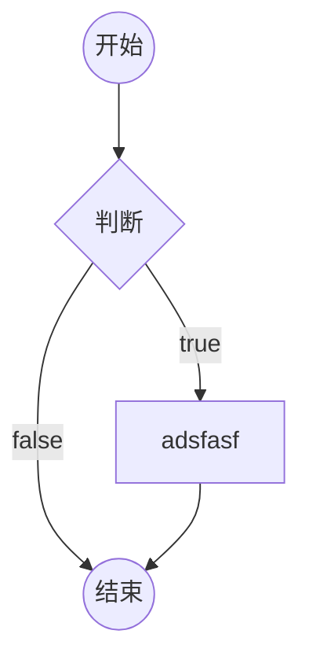
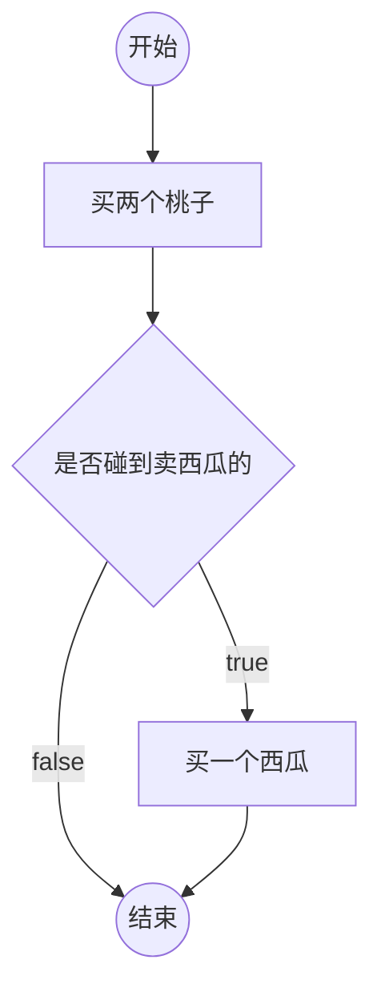
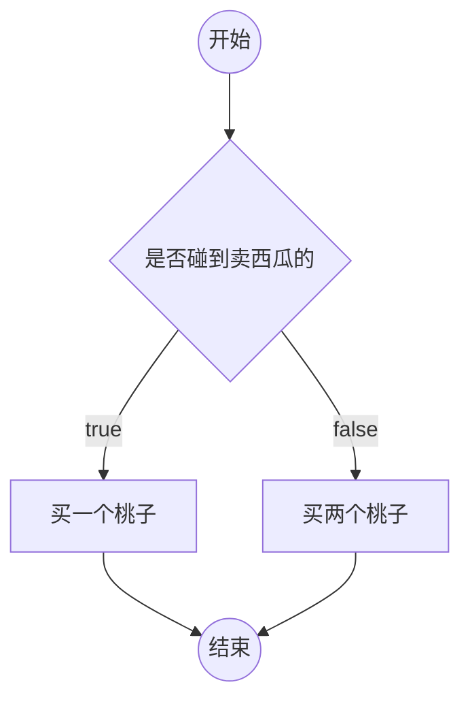
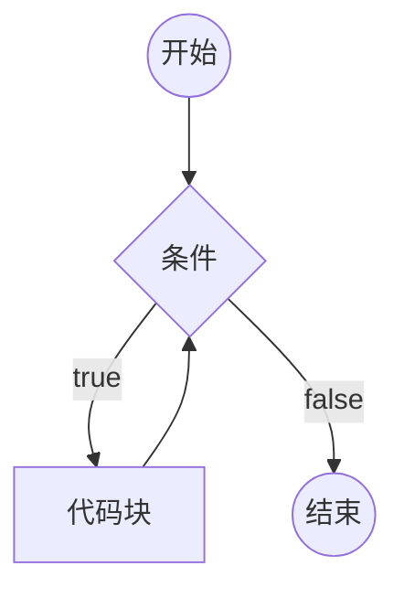
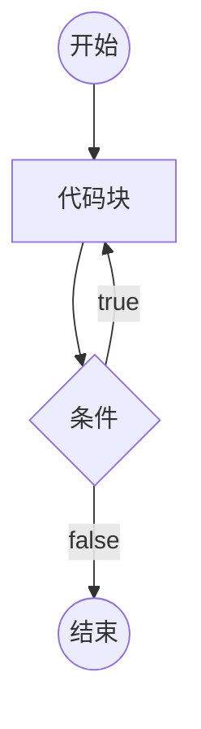
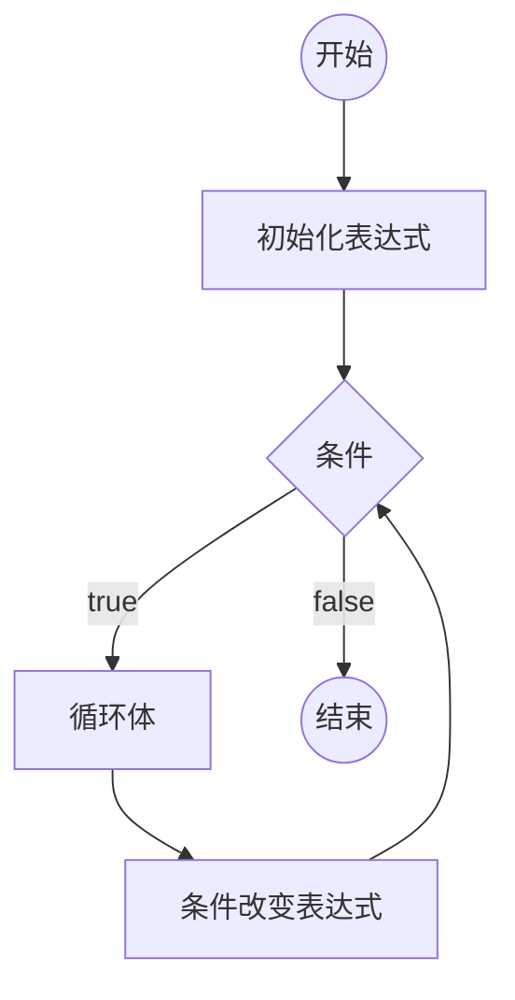

# 比较运算符

大小比较： >  <   >=   <=
相等比较： ==   != === !==

**比较运算符的返回类型：boolean**
**算数运算符的优先级高于比较运算符**

## 大小比较

两个字符串比较大小，比较的是字符串的字符编码。
> 字符串比较大小时，是一位一位进行比较
```js
console.log("AB" > "A");
第一步：先比较第一位，即："A"与"A"比较，然后"B"在进行比较
```

**细节**

1. 两个字符串比较大小，比较的是字符串的字符编码。
2. 如果一个不是字符串，并不且两个都是原始类型，将他们都转换为数字进行比较
   ```js
    console.log("1" >= 1);
    console.log("2" > true);
    ```
- NaN与任何数字进行比较，得到的结果都是**false**
    ```js
    console.log(NaN > 0);
    ```
- Infinity比任何数字都大
- -Infinity比任何数字都小

3. 如果其中一个是对象，讲对象转换为原始类型，然后按照规则1或者规则2进行比较

> 目前，对象转换为原始类型后，是字符串 "[Object Object]"
```js
console.log(1 > {});//false
1.{}转换为字符串为:"[Object Object]"
2.字符串"[Object Object]"转换为数字为NaN
3.NaN与任何数字进行比较,结果都是false
console.log(null > -1);//true
console.log(undefined > -1);//false
undefined转换为数字为NaN
```

## 相等比较

### == 和 !=  （相等比较和不相等比价）

==: 比较两个数据是否相等，相等返回true，不相等返回false
!=: 比较两个数据是否不相等

```js
console.log(1 == 1);//true
console.log(1 != 1);//false
console.log("abc" == "abc");//true
```

**细节**

1. 两端的数据类型相同：直接比较两个数据本身是否相同（两个对象比较的地址）

2. 两端的类型不同
        
1). null 和 undefined，他们直接相等，和其他原始类型比较，则不相等
```js
console.log(null == undefined);//true
console.log(null != undefined);//false
console.log(null == 0);//false
console.log(null >= 0); //true
console.log(undefined == 0); //false
```

2). 其他原始类型比较时，先转换为数字，再进行比较
```js
console.log("1" == 1);//true
```

3). NaN与任何数字比较，包括自身都是**false**

4). Infinity 和 -Infinity，**自身和自身相等**

5). 对象比较时，要先转换为原始类型，再进行比较

**由于相等和不相等比较，对于不同类型的数据比较违反直觉，因此，通常我们不使用这种比较方式，而是使用功能架接近直觉的严格相等和严格不相等进行比较**

### ===  和 !==  （严格相等和严格不相等）

===： 两端的数据和类型必须相同，才为true
!==:  两端的数据或类型不相同
```js
console.log(1 === true);//false
```

1. 两端类型相同，规则和相等比较一致。
2. 两端类型不同，为false

数字规则：
1). NaN与任何数字比较，包括自身都是**false**
2). Infinity 和 -Infinity，**自身和自身相等**


# 逻辑运算符

逻辑运算符：也叫作**布尔运算符**

## 与（并且）

符号： &&

书写方式： 表达式1 && 表达式2  两个表达式都要满足

1. 将表达式1进行boolean判定

以下数据均判定为false：

1) null
2) undefined
3) false
4) NaN
5) " "
6) 0

其他数据全部为真

2. 如果表达式1的判定结果为**假**，则直接返回表达式1，而不执行表达式2；反之，则返回表达式2的结果。（短路规则）

```js
console.log(5 > 3 && 3 > 2);//true
console.log(5 > 3 && 100);//100
console.log(0 && 2);//0

經典題1：
var x = 1;
console.log(x > 2 && x++ > 0);//false
console.log(x);//1

經典題2：
console.log(1 && 2 && 3 && 4 && 0);//0

```  

## 或

符号： ||

写法： 表达式1 || 表达式2

1. 将表达式1 进行 boolean 判定

2. 如果表达式1为**真**，直接返回表达式1，不运行表达式2； 否则，返回表达式2

## 非

符号： ！

写法： !数据

一元运算符

将数据的boolean判定结果直接取反，非运算符一定返回boolean类型


# 三目运算符

书写方式： 表达式1 ？ 表达式2 ：表达式3

1. 对表达式1进行boolean判定
2. 如果判定结果为真，返回表达式2；否则，返回表达式3

# 补充知识

## 模板字符串

```js
` `

var user = {
    age : 18,
    sex : "男",
    name : "不知道"
}
console.log("我叫" + user.name + ", 我今年" + user.age + ",我是一个" + user.sex);
console.log(`我叫${user.name},我今年${user.age}岁了，我是一个${user.sex}`);

```
## 类型转换不会影响原本的数据

```js

var x = "1";
var y = x + 2;
console.log(x, typeof x);//1, string
//仅仅只是在运算过程中将字符串转为数字类型，但是实质类型仍然为string
// typeof：表示查看一个变量的类型，是一个字符串

```
## 复合的赋值运算符

+=  -=  /=  *=  %=  **=

```js

var x = 1;
    x = x++;//x = x + 1
    x *= x++ + 2; // x = x * (x++ + 2);

```

## void 运算符

一元运算符

写法：

1. 普通写法： ``` void 表达式  ```
2. 函数写法： ``` void(表达式)  ```

运行表达式，然后返回undefined

## typeof 运算符

一元运算符

写法：

1. 普通写法： ``` typeof 表达式  ```
2. 函数写法： ``` typeof(表达式)  ```

typeof运算，返回表达式的类型，是一个字符串。

## 逗号运算符

写法：表达式1, 表达式2

依次运行两个表达式，返回表达式2

逗号运算符的优先级比赋值更低

```js

var x = 1;
        x = (x++ * 2, x++ * 2, x++ * 2);
        console.log(x);

```

# 数字的存储

**在对精度要求很高的系统中，或要对小数的运算结果进行比较时，需要特别谨慎**

## 问题

1. JS中的小数运算是精确的吗？

不一定

2. JS中的整数运算是精确的吗？

不一定

3. JS中表示的整数是连续的吗？

不是，当JS的数字很大的时候，不再连续。

4. JS中表示的最大数字是多少？

最大连续整数：9007199254740991

5. JS中能表示的数字的有效位数是多少？

16 ~ 17


## 二进制

现实世界中：十进制，10个数字，逢十进一

计算机世界中：二进制，2个数字，逢二进一

二进制 -> 十进制

1101 -> $1*2^3 + 1*2^2 + 0*2^1 + 1*2^0 = 13$

11.01 -> $1*2^1 + 1*2^0 + 0*2^{-1} + 1*2^{-2} = 3.25$

十进制 -> 二进制

13 -> 1101

```
13 / 2  商 6    余  1
6  / 2  商 3    余  0
3  / 2  商 1    余  1
1  / 2  商 0    余  1
余数从下往上看
```

3.25 -> 11.01

整数部分一样

小数部分

```
0.25 * 2    0.5     整数部分：0
0.5  * 2    1.0     整数部分：1
整数部分从上往下看
```

## 为什么JS的小数运算不精确

十进制的小数，转换为二进制后，可能是无限小数，但是计算机对数字的存储能力有限，因此会丢失一些数据。

十进制数 0.3 -> 0.010011001100110011001.....

```
0.3*2   0.6     0
0.6*2   1.2     1
0.2*2   0.4     0
0.4*2   0.8     0
0.8*2   1.6     1
0.6*2   1.2     1
0.2*2   0.4     0
......
整数部分从上往下看
```

## JS如何存储数字

整数法、浮点法

JS中，存储的所有数字，都按照浮点法存放。

浮点法存放的数字，叫做浮点数（float），浮点数分为单精度和双精度。

JS中，使用双精度存放浮点数，IEEE 754。

**存放方式**

JS在计算机中，给每个数字开辟一块内存空间，尺寸固定为64位

> 在计算机中，位（bit）是最小的存储单位，简称为bit
> 1 byte = 8 bit
> 1 KB = 1024 byte
> 1 MB = 1024 KB
> 1 GB = 1024 MB

```
[第1段][第2段][第3段]

第1段：1位，表示符号位，如果为1，是负数，如果为0，是正数
第2段：11位，表示指数位，这里的指数是2为底的指数，而不是10
第3段：52位，表示有效数字
```

举例

```
0     1000 0000 011    1111 0000 0000 0000....
```
相当于： $1.1111 * 2 ^ {1027 - 1023} $

**特殊情况**

1. 指数为0，尾数为0，表示数字 0
2. 符号为0，指数为2047，尾数为0，表示正无穷

```
Infinity: 0 11111111111 00000000000...
```

3. 符号为1，指数为2047，尾数为0，表示负无穷

```
-Infinity: 1 11111111111 00000000000...
```

4. 指数为2047，尾数不为0，表示NaN

```
NaN: 1 11111111111 01001010000...
```

**一个正常的数字，指数部分最多是2046**

## 能表示的最大数字

```
0 11111111110 1111111111.........
```

相当于： $1.1111111111... * 2 ^ 1023 $

## 能表示的最大的安全整数

安全数字：从1开始到该数字，均是连续的整数，并且该数字的下一个整数是存在的。

```
0 xxxxx 1111111111....
```

相当于： $2^53 - 1$

下一位： $2^53$   ```0  xxxxx  0000000000000```


# 流程图

一套的标准的图形，用于描述程序的逻辑

通常流程图分析程序的流程


> markdown中粘贴图片，ctrl + alt + v

## 在 markdown 中画流程图



## 例子

邓哥的思维：



成哥的思维：



# if判断

```js
if(条件1){
    // 代码块
}
else if(条件2){
    // 代码块
}
else if(条件3){
    // 代码块
}
//....
else{
    // 以上条件都不满足执行的代码块
}
```

1. 如果某个条件满足，则直接忽略后面的所有条件
2. else if 可以有多个（包含0个）
   ```js
    if (条件) {}
    ```
3. else可以有1个或0个
   ```js
    if (条件) {
    //代码块
   }else if (条件2) {
   //代码块
   }
    ```
4. else可以换行，可以不换行
5. 如果代码块只有一条语句，可以省略花括号（不推荐）
6. if只能出现一次


## 补充

1. 用户输入: prompt("提示文本")

该表达式返回结果：

- null：表示用户点击了取消
- 用户输入的字符串：表示用户点击了确定，得到用户输入的结果

返回类型：null 或 字符串

```js
    var result = prompt("请输入你的年龄");
    if (result === null) {
        alert("你点击了取消")
    } else {
        result = +result;//将字符串转为数字
        if (isNaN(result)) {
            console.log("不是正常的数字")
        }else {
            console.log(result, typeof result);
        }
    }
```

2. 将字符串转换成数字：**+字符串**

3. 得到一个随机数

Math.random() 该表达式返回一个0~1之间的随机数字（无法取到1）


# switch 开关

switch的语法始终可以使用if结构替代。

```js
switch(表达式){
    case 数据1:
        代码块
    case 数据2:
        代码块
    //...
    default:
        代码块
}
```

1. 计算表达式的返回值，依次和case后面的数据进行严格相等的比较，如果某个相等，停止比较，然后运行其内部的代码块，再然后，依次运行之后的所有代码块。
2. 在case分支内部，使用break语句，可以立即停止switch结构。
3. default表示前面的所有case都不匹配时运行。可以省略

# 循环

重复的运行一段代码

JS支持3种循环结构：while循环、do-while循环、for循环

## while循环

```js
while(条件){
    代码块（循环体）
}
```



死循环：条件永远满足，永远无法退出循环。

## do-while循环

```js
do{
    循环体
} while(条件);
```




## for循环

```js
for(初始化表达式; 条件; 条件改变表达式){
    循环体
}
```




## 循环中的关键字

循环控制语句

- break; 跳出循环
- continue; 停止当前循环体，进入下一次循环。


# 循环应用

## 累计

举例：将1-100的所有数字相加之和

思路：准备一个变量，初始值为0，然后1-100循环，每次循环，将数字累加到变量中。

## 查找

举例：135~145之间是否存在能整除26的数字

思路：准备一个变量，记录false，表示没有找到，然后135-145进行循环，如果发现满足条件的数字，重新记录变量为true，表示找到了，然后退出循环。

## 嵌套的循环

分开分析两层循环


# 数组

数组用于存放多个数据

## 创建一个数组

1. new Array(长度)

长度，数组里面的数据总数，长度一定是一个非负整数

new Array(数据, 数据, 数据....)

创建一个数组，并初始化其每一项的值

数组项：数组其中的一项数据

2. [数据,数据,数据,....]

创建一个数据，并初始化其每一项的值

## 认识数组的本质

数组的本质是一个对象

- length属性：数组的长度，会自动变化，值为最大下标+1
- 数字字符串属性：叫做下标，也叫做索引，相当于数组中每个数据的编号，下标从0开始排列


连续下标的取值范围：0 ~ length -1，如果给length直接赋值，会导致数组可能被截断

实际开发中，不要给length赋值。

## 下标

通常情况下，下标是连续的。

下标不连续的数组，叫做稀松数组。

## 数组的常见操作

### 添加数组项

- 数组[长度] = 数据：向数组末尾添加一个数据
- 数组.push(数据): 向数组末尾添加一个数据
- 数组.unshift(数据)：向数组起始位置添加一个数据，会导致数组每一项的下标向后移动
- 数组.splice(下标, 0, 添加的数据): 从指定下标位置开始，删除0个，然后在该位置插入添加的数据，如果下标超过范围，则按照范围的边界进行处理。

push、unshift、splice可以添加多个数据

### 删除数据

- delete 数组[下标]: 这种做法不会导致数组其他的属性发生变化，因此，该做法会导致产生稀松数组，所以不推荐使用该做法。
- 数组.pop(): 删除数组的最后一项，该表达式返回最后一项的数据
- 数组.shift()：删除数组第一项，该表达式返回第一项的数据
- 数组.splice(下标, 删除的数量, 添加的数据): 从指定下标位置开始，删除指定数量，然后在该位置插入添加的数据，如果下标超过范围，则按照范围的边界进行处理。返回一个新数组，该数组记录被删除的数据。

### 其他操作

- 数组.slice(起始位置下标, 结束位置下标)：将起始位置到结束位置之间的数据拿出来，得到一个新的数组，该函数不会改变原数组；注意：结束下标取不到

下标可以写负数，如果是负数，则从数组的末尾开始计算。

如果不写结束下标，则直接取到末尾。

- 数组清空

数组.splice(0, 数组.length);

数组.length = 0;

- 查找数组中某一项的下标

数组.indexOf(数据)

从数组中依次查找对应的数据，查找时使用严格相等进行比较。找到第一个匹配的下标，返回。如果没有找到，则得到-1；

数组.lastIndexOf(数据)

功能和indexOf类似，只是查找的是最后一个匹配的下标

- 数组.fill

数组.fill(数据)：将数组的所有项，填充为指定的数据

数组.fill(数组, 开始下标): 将数组从开始下标起，到数组的末尾，填充为指定的数据

数组.fill(数组, 开始下标，结束下标): 将数组从开始下标起，到数组的结束下标（取不到），填充为指定的数据


## 语法补充

### in关键字

判断某个属性在对象中是否存在

属性名 in 对象

### for-in  foreach 循环

```js
for(var prop in 对象){
    //循环体
}
```

取出对象的所有属性名，每次循环将其中一个属性名赋值给变量prop，运行循环体。
