# HTML5新增属性

## input新增属性

### placeholder[提示性属性]

```css
<input type="text" placeholder= "电话/邮箱/用户名">
<input type="password" placeholder= "请输入密码">
```
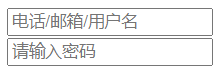

当获取焦点，在文本框内输入信息时，提示信息就会隐藏；当删除文本信息获取到焦点时，就会和重现出现。

### Calendar类

- data：日期 chrome支持，safari，IE不支持
- time：时间 chrome支持，safari，IE不支持
- week：周  chrome支持，safari，IE不支持
- datetime-loca：日期+周数 chrome支持，safari，IE不支持
- number：数字（只能输入数字） chrome支持，safari、IE不支持
- email：邮箱    chrome、火狐支持，Safari、IE不支持
- color：颜色    chrome支持，safari、IE不支持
- range：滑动块   chrome、safari支持，火狐、IE不支持
- search：提示（浏览器密码提示）   chrome支持，safari支持一点，IE不支持
- url：地址  chrome、火狐支持，safari、IE不支持

## contenteditable属性

使用方法：
```css
<div contenteditable="true">
    可以修改的内容，没有兼容性问题，是可以使用的
</div>
```

注意事项：
- contenteditable属性没有兼容性问题，可以使用
- contenteditable属性是可以继承的，如果父级有，子级是可以继承的；
    但是如果子级的 **contenteditable="false"时，子级是不可以进行修改的**
- 不建议的使用情况：
```css
<div contenteditable="true">
    <span contenteditable="false">name:</span>summer <br>
    <span contenteditable="false">sex:</span>male
</div>
name 和 sex不可以修改，但是summer和male可以进行修改；在修改时甚至会**删除**br标签和span标签
```


## draggable属性

draggable属性：可以实现按下拖拽

```css
<div class="isDiv" draggable="true"></div>
```
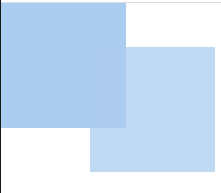

- draggable兼容性：chrome、safari可以正常使用，firefox不支持
- **a标签** 和 **img标签**默认也是可以进行拖拽的
- 拖拽的生命周期：1.拖拽开始，拖拽进行中，拖拽结束。
- 拖拽的组成：1.被拖拽的物体，目标区域。
- 按下一瞬间是不会触发事件的。
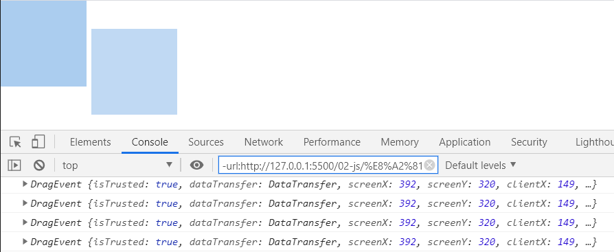
```js
    var isDiv = document.getElementsByClassName("isDiv")[0];
    //拖拽开始
    isDiv.ondragstart = function (e) {
        console.log(e)
    }
    //拖拽时间
    isDiv.ondrag = function (e) {
        console.log(e)
    }
    //拖拽结束
    isDiv.ondragend = function (e) {
        console.log(e);
    }
```

```js
 e.dataTransfer.effectAllowed = "link"; //copy move copyMove linkMove all
该属性只能在 **ondragstart**中使用
```

```js
e.dataTransfer.dropEffect = "link";
该属性只能在**ondrop** 中使用
```


## canvas

canvas:相当于一块画布，可以在里面绘制动画

注意：
- canvas就是一个标签
- 要是想使用，就要在js中使用

例如：
```JS
<body>
<!--画布大小-->
<canvas id="isCanvas" width="500px" height="300px"></canvas>

<script>
    var canvas = document.getElementById("isCanvas");
    //获取画笔，内容区域
    var ctx = canvas.getContext("2d");
    // 起点
    ctx.moveTo(100,100);
    // 从哪里画到哪里
    ctx.lineTo(200,100);
    ctx.lineTo(200,200);
    // ctx.lineTo(100,100);
    // 如果忘记起点，想让图形闭合，则使用一下：
    ctx.closePath();
    // 渲染
    ctx.stroke();
</script>
</body>
```

注意：
- 要是想设置画布大小，就要在canvas标签里面设定宽高，这才是画布的宽高；
- 如果实在css中设置canvas的宽高，则不是画布的实际宽高；

属性：

1. var ctx = canvas.getContext("2d");
这个属性就是获取画布，也就是获取到画布的内容区域
2. ctx.moveTo(100,100);
画笔的起点，从哪个点开始；只有数字，没有单位；在x，y轴上，确定一个具体的点；
3. ctx.lineTo(200,100);
这个属性就是从哪里画到哪里；只有数字，没有单位;
4. ctx.closePath();
当画了太多线，不知道起点该怎么绕回时，就是用该属性，可以闭合图形；
只针对于某一种路径，而不是一个整体；比如使用了beginPath，那么只对beginPath里面的图形实现闭合。
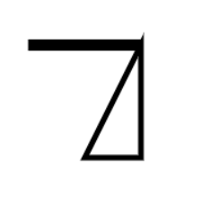
5. ctx.fill();
填充图形，图形就是实心而不是空心；
6. ctx.stroke();
渲染图形，不然画布上不会出现图形;
7. ctx.lineWidth = 10;
线条的宽度
注意：
- lineWidth相当于一直在moveTo之前声明；
- 如果想使用一条线宽，一条线细，则使用一下方法：
```js
<script>
    var canvas = document.getElementById("isCanvas");
    //获取画笔，内容区域
    var ctx = canvas.getContext("2d");
    // 起点
    ctx.moveTo(100,100);
    // 从哪里画到哪里
    ctx.lineTo(200,100);
    // ctx.lineTo(100,100);
    // 如果忘记起点，想让图形闭合，则使用一下：
    ctx.closePath();
    // 填充
    // ctx.fill();
    // 线条加粗
    ctx.lineWidth = 10;
    // 渲染
    ctx.stroke();

    ctx.beginPath();
    ctx.moveTo(200,100);
    ctx.lineTo(200,200);
    ctx.lineWidth = 1;
    ctx.stroke();
</script>
```


## 圆形绘制

绘制圆形必须要有：

- 圆心：x，y
- 半径：r
- 弧度：起始弧度，结束弧度；弧度一般用Math.PI表示，Math.PI = 180°。
- 顺时针，逆时针；顺时针用**0**表示，逆时针用**1**表示；

```js
<canvas id="isCanvas" width="500px" height="300px"></canvas>

<!--圆心（x，y），半径(r),弧度（起始弧度，结束弧度：Math.PI = 180度），方向(顺时针0，逆时针1)-->
<script>
    var canvas = document.getElementById("isCanvas");
    var ctx = canvas.getContext("2d");

    // 圆心：100,100 半径为：50， 起始弧度为0，结束弧度为90度，顺时针
    ctx.arc(100, 100, 50, 0, Math.PI / 2, 0);
    
    // 圆心：100,100 半径为：50， 起始弧度为0，结束弧度为90度，逆时针
    ctx.arc(100, 100, 50, 0, Math.PI / 2, 1);
    
    ctx.stroke();
</script>
```
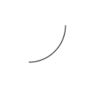

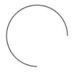

```js
    ctx.arc(100, 100, 50, 0, Math.PI * 1.9, 0);
    ctx.lineTo(100,100);
    ctx.closePath();
    ctx.stroke();

```
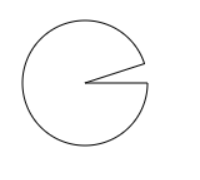


## 圆角矩形

```js
<script>
    var canvas = document.getElementById("isCanvas");
    var ctx = canvas.getContext("2d");

    ctx.moveTo(100,110);
    ctx.arcTo(100, 300, 200, 300, 10);
    ctx.arcTo(200, 300, 300, 100, 10);
    ctx.arcTo(200, 100, 100, 100, 10);
    ctx.arcTo(100, 100, 100, 300, 10);
    ctx.fill();
    ctx.stroke(); 
</script>
```

注意：

- arcTo(100, 300, 200, 300, 10);所代表的的意义为：B点的坐标，c点的坐标（只是为了标记方向，而不是实线），圆角；

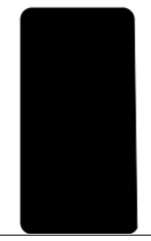


## 贝塞尔曲线

```js
<script>
    var canvas = document.getElementById("isCanvas");
    var ctx = canvas.getContext("2d");

    ctx.beginPath();
    ctx.moveTo(100, 100);
    // 二次贝塞尔曲线
    // ctx.quadraticCurveTo(300, 300, 500, 100);
    // 三次贝塞尔曲线;
    ctx.bezierCurveTo(200, 400, 300, 100, 400, 300);
    ctx.stroke();
</script>
```

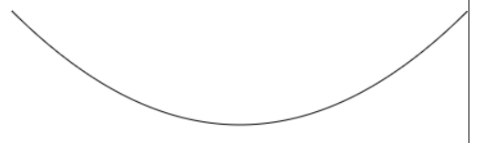

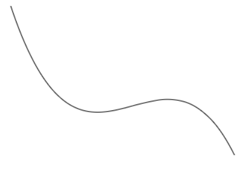


## canvas的其他属性

### rotate

rotate：旋转角度

> canvas的旋转起始点默认为画布的起始点
> 如果想更改起始点，则使用translate进行偏移改变

```js

<script>
    var canvas = document.getElementById("isCanvas");
    var ctx = canvas.getContext("2d");

    ctx.translate(100, 100);
    ctx.rotate(Math.PI / 6);
    ctx.moveTo(0, 0);
    ctx.lineTo(100, 0);
    ctx.stroke();
</script>

```

### scale

scale:缩放/放大

```js
    ctx.beginPath();
    ctx.scale(1, 2);
    ctx.strokeRect(100, 100, 100, 100);
```

- scale：在矩形自身的基础上进行放大/缩小
- ctx.scale(1, 2)就是相当于矩形的x*1， y*2


### sava && restore

- 因为rotate 和 translate 是一个全局变量，所以当我们使用beginPath重新开始一个新的路线时，就会出现问题
- 使用save和restore之后，可以改变这个问题

```js
<script>
    var canvas = document.getElementById("isCanvas");
    var ctx = canvas.getContext("2d");


    ctx.save();
    ctx.beginPath();
    ctx.translate(100, 100);
    ctx.rotate(Math.PI / 4);
    ctx.strokeRect(0, 0, 100, 50);


    ctx.beginPath();
    ctx.restore();
    ctx.fillRect(200, 0, 100, 50);
</script>
```

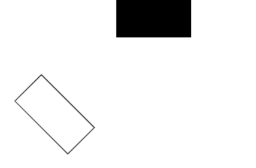

> save: 保存坐标系的平移数据，缩放数据，旋转数据
> restore：恢复到保存之前的状态，重新开始一个路线


## 背景填充

### 图案/单色填充

- fillStyle:填充颜色

```js
<script>
    var canvas = document.getElementById("isCanvas");
    var ctx = canvas.getContext("2d");

    var img = new Image();
    img.src = "../img.png";

    img.onload = function () {
        ctx.beginPath();
        ctx.translate(100, 100);
        var bg = ctx.createPattern(img, "no-repeat");
        ctx.fillStyle = bg;
        ctx.fillRect(0, 0, 200, 100);
    }
</script>
```

注意：

- canvas的背景填充图案是根据坐标系原点进行填充的


### 线性填充

- ctx.createLinearGradient(0, 0, 200, 0);表示从哪一个坐标填充到另一个坐标
- addColorStop(0, "white");表示填充的颜色，数字只能是**0**-**1**，但是可以是0-1的多个值
- addColorStop(0.5, "blue");

> 线性填充的起始点仍然为坐标的起始点，而不是矩形的起始点，所以仍然得使用translate

```js
    ctx.beginPath();
    var bg = ctx.createLinearGradient(0, 0, 200, 0);
    bg.addColorStop(0, "white");
    bg.addColorStop(0.5, "yellow")
    bg.addColorStop(1, "black");
    ctx.fillStyle = bg;
    ctx.fillRect(0, 0, 200, 100);
```

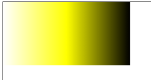


### 辐射填充

- ctx.createRadialGradient(100, 100, 30, 100, 100, 100);两个圆的圆心和半径

```js
    var bg = ctx.createRadialGradient(100, 100, 30, 100, 100, 100);
    bg.addColorStop(0, "red");
    bg.addColorStop(0.5, "green");
    bg.addColorStop(1, "blue");
    ctx.fillStyle = bg;
    ctx.fillRect(0, 0, 200, 200);
```

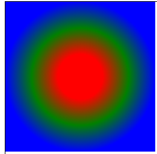


## 阴影

- shadowColor：阴影的颜色；
- shadowBlur：阴影的大小，没有单位，直接填写数字；数字越小越清晰，反之，数字越大越模糊
- shadowOffsetX:向x方向平移
- shadowOffsetY：向y方向平移

```js
    var canvas = document.getElementById("isCanvas");
    var ctx = canvas.getContext("2d");

    ctx.beginPath();
    ctx.shadowColor = "red";
    ctx.shadowBlur = 5;
    ctx.shadowOffsetX = 25;
    ctx.arc(200, 200, 50, 0, Math.PI * 2 , 1);
    ctx.stroke();
```

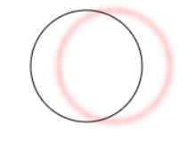


## 绘制文字

```js
<script>
    var canvas = document.getElementById("isCanvas");
    var ctx = canvas.getContext("2d");

    ctx.beginPath();
    ctx.strokeRect(0, 0, 200, 200);

    ctx.font = "30px Georgia";//font对strokeText和fillText都起作用
    ctx.strokeText("Summer", 100, 200);//文字描边，空心

    ctx.fillStyle = "red";
    ctx.fillText("Wram", 300, 100);//文字填充，比较虚，是正常的文字输入


</script>
```

解析：
- ctx.strokeText("Summer", 100, 200);表示文字描边，空心字体
- ctx.fillText("Wram", 300, 100);表示文字填充，比较虚，是正常的文字输入
- ctx.font = "30px Georgia"; font对strokeText和fillText都起作用

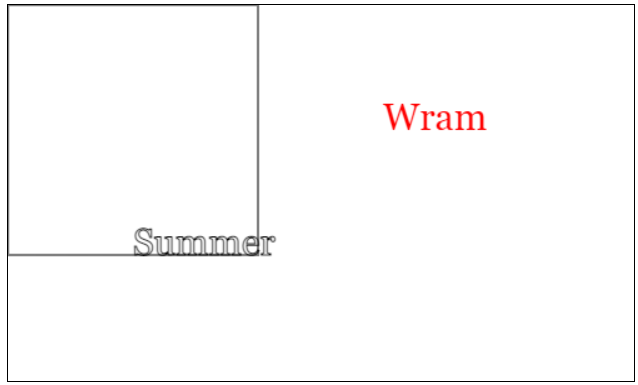


## 线端样式

### lineCap

- ctx.lineCap = "butt";     butt：为默认值，啥变化也没有

- ctx.lineCap = "square";   square:加了一个方形小帽，线条边长了

- ctx.lineCap = "round";    rouond：左右两边加了一个半圆，线条边长了


### lineJoin:两条线接触时的属性


- ctx.lineJoin = "miter";   miter: 默认值

- ctx.miterLimit = 5;   截掉小尖
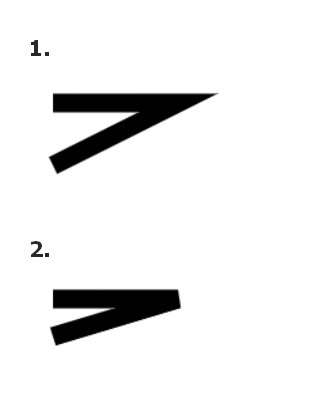
  
- ctx.lineJoin = "round";   round：变得柔和
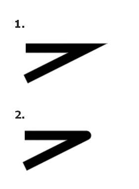

- ctx.lineJoin = "bevel";   bevel:截掉小尖
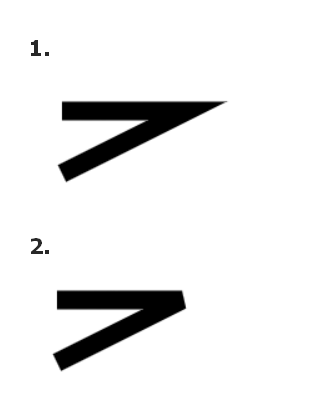


## svg

1. svg:矢量图，放大不会失真，适合大面积的贴图，通常通话较少或者较简单，标签和css去画
2. canvas：适合用于小面积的绘画，适合动画

### svg画线/画矩形

- svg是使用标签和css去画图形的；

- 所有闭合的图形，在svg中默认都是填充绘画好的。

```html
<!DOCTYPE html>
<html lang="en">
<head>
    <meta charset="UTF-8">
    <title>svg</title>
    <style>
        svg {
            width: 500px;
            height: 500px;
            border: 1px solid;
        }
        .line1 {
            stroke: black;
            stroke-width: 5px;
        }
        .line2 {
            stroke: red;
            stroke-width: 10px;
        }
    </style>
</head>
<body>
<svg>
    <line x1="100" y1="100" x2="200" y2="100" class="line1"></line>
    <line x1="200" y1="100" x2="200" y2="200" class="line2"></line>
    <rect height="50px" width="100px" x="0" y="0" rx="5" ry="5"></rect>
</svg>
</body>
</html>
```

代码解析：

- <line></line>:画出一条直线，所需参数为：x1,y1为起始点无单位，s2,y2为终点无单位，也就是从哪画到哪；
- stroke属性：在css中使用，属性值为颜色，起到渲染作用
- stroke-weight:在css中使用，表示线条的宽度，单位为**px**

- rect：绘制封闭图形，比如矩形，圆角矩形等。所需参数：height，width：图形高度，单位为**px**，x,y：起始点的位置没有单位，rx：x轴上的圆角，y：y轴上的圆角，无单位
  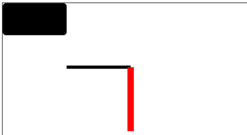


## 圆&椭圆&折线

```html
<!DOCTYPE html>
<html lang="en">
<head>
    <meta charset="UTF-8">
    <title>圆&椭圆&折线</title>
    <style>
        svg {
            width: 500px;
            height: 500px;
            border: 1px solid;
        }
        polyline {
            fill: transparent;
            stroke: #008c8c;
            stroke-width: 5px;
        }
        circle, ellipse {
            fill: transparent;
            stroke: #abcdef;
            stroke-width: 5px;
        }

    </style>
</head>
<body>
<svg>
<!--圆-->
    <circle r="50" cx="50" cy="220"></circle>
<!--椭圆-->
    <ellipse rx="30" ry="15" cx="400" cy="200"></ellipse>
<!--折线-->
    <polyline points="0 0, 100 50, 200 100, 200 200, 100 200, 50 100"></polyline>
</svg>
</body>
</html>

```

1. 圆

- circle元素，所需属性：r 表示半径， cx ，cy 表示圆心的位置

2. 椭圆

- ellipse元素，所需属性：rx 表示x轴的半径，ry 表示y轴半径，cx ，cy 表示圆心的位置

3. 折线

- polyline元素，所需属性：points 每个点的位置，一个点与一个点之间使用逗号隔开
- polyline和polygon的区别：polyline  到结束点就会停止；   polygon  到结束点会闭合，成为多边形

4. 因为均为封闭图形，所以都有填充颜色，如果只想要边框不要填充，则可以在css中使用以下属性：
- fill：transparent;   填充背景为透明
- stroke: #abcdef;      线条的颜色
- stroke-width: 5px;    线条的宽度

  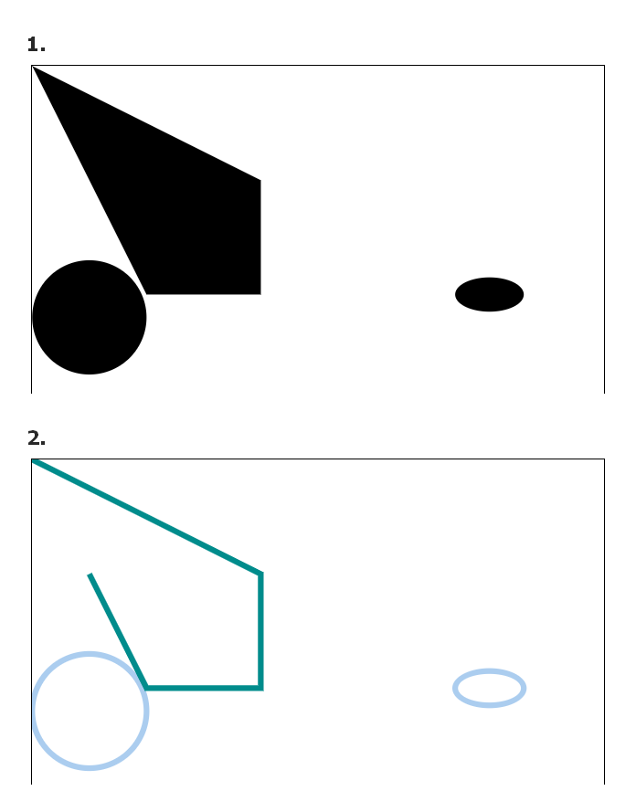


## 多边形&文本

### 多边形

1. polygon元素，和polyline所需属性一样

### 文本

1. text元素，所需属性：x，y 起始坐标，文本内容

```html
<!DOCTYPE html>
<html lang="en">
<head>
    <meta charset="UTF-8">
    <title>多边形&文本</title>
    <style>
        svg {
            width: 500px;
            height: 500px;
            border: 1px solid;
        }
        polygon {
            fill: transparent;
            stroke: #008c8c;
            stroke-width: 5px;
        }
    </style>
</head>
<body>
<svg>
    <polygon points="0 0, 100 50, 200 100, 200 200, 100 200, 50 100"></polygon>
    <text x="300" y="100">StudHard</text>
</svg>
</body>
</html>

```
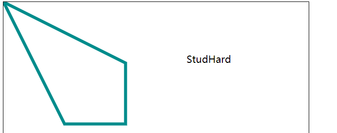


