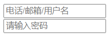
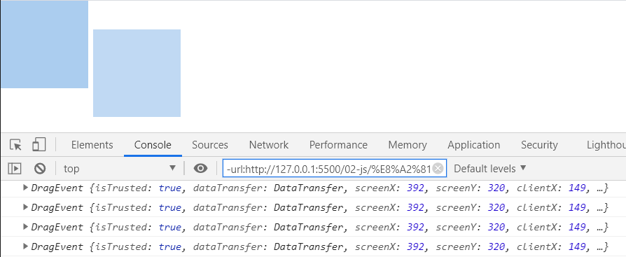
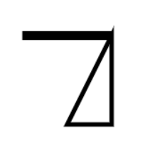
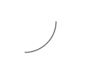
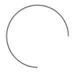
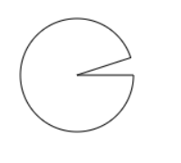

# HTML5新增属性

## input新增属性

### placeholder[提示性属性]

```css
<input type="text" placeholder= "电话/邮箱/用户名">
<input type="password" placeholder= "请输入密码">
```


当获取焦点，在文本框内输入信息时，提示信息就会隐藏；当删除文本信息获取到焦点时，就会和重现出现。

### Calendar类

- data：日期 chrome支持，safari，IE不支持
- time：时间 chrome支持，safari，IE不支持
- week：周  chrome支持，safari，IE不支持
- datetime-loca：日期+周数 chrome支持，safari，IE不支持
- number：数字（只能输入数字） chrome支持，safari、IE不支持
- email：邮箱    chrome、火狐支持，Safari、IE不支持
- color：颜色    chrome支持，safari、IE不支持
- range：滑动块   chrome、safari支持，火狐、IE不支持
- search：提示（浏览器密码提示）   chrome支持，safari支持一点，IE不支持
- url：地址  chrome、火狐支持，safari、IE不支持

## contenteditable属性

使用方法：
```css
<div contenteditable="true">
    可以修改的内容，没有兼容性问题，是可以使用的
</div>
```

注意事项：
- contenteditable属性没有兼容性问题，可以使用
- contenteditable属性是可以继承的，如果父级有，子级是可以继承的；
    但是如果子级的 **contenteditable="false"时，子级是不可以进行修改的**
- 不建议的使用情况：
```css
<div contenteditable="true">
    <span contenteditable="false">name:</span>summer <br>
    <span contenteditable="false">sex:</span>male
</div>
name 和 sex不可以修改，但是summer和male可以进行修改；在修改时甚至会**删除**br标签和span标签
```


## draggable属性

draggable属性：可以实现按下拖拽

```css
<div class="isDiv" draggable="true"></div>
```


- draggable兼容性：chrome、safari可以正常使用，firefox不支持
- **a标签** 和 **img标签**默认也是可以进行拖拽的
- 拖拽的生命周期：1.拖拽开始，拖拽进行中，拖拽结束。
- 拖拽的组成：1.被拖拽的物体，目标区域。
- 按下一瞬间是不会触发事件的。

```js
    var isDiv = document.getElementsByClassName("isDiv")[0];
    //拖拽开始
    isDiv.ondragstart = function (e) {
        console.log(e)
    }
    //拖拽时间
    isDiv.ondrag = function (e) {
        console.log(e)
    }
    //拖拽结束
    isDiv.ondragend = function (e) {
        console.log(e);
    }
```

```js
 e.dataTransfer.effectAllowed = "link"; //copy move copyMove linkMove all
该属性只能在 **ondragstart**中使用
```

```js
e.dataTransfer.dropEffect = "link";
该属性只能在**ondrop** 中使用
```


## canvas

canvas:相当于一块画布，可以在里面绘制动画

注意：
- canvas就是一个标签
- 要是想使用，就要在js中使用

例如：
```JS
<body>
<!--画布大小-->
<canvas id="isCanvas" width="500px" height="300px"></canvas>

<script>
    var canvas = document.getElementById("isCanvas");
    //获取画笔，内容区域
    var ctx = canvas.getContext("2d");
    // 起点
    ctx.moveTo(100,100);
    // 从哪里画到哪里
    ctx.lineTo(200,100);
    ctx.lineTo(200,200);
    // ctx.lineTo(100,100);
    // 如果忘记起点，想让图形闭合，则使用一下：
    ctx.closePath();
    // 渲染
    ctx.stroke();
</script>
</body>
```

注意：
- 要是想设置画布大小，就要在canvas标签里面设定宽高，这才是画布的宽高；
- 如果实在css中设置canvas的宽高，则不是画布的实际宽高；

属性：

1. var ctx = canvas.getContext("2d");
这个属性就是获取画布，也就是获取到画布的内容区域
2. ctx.moveTo(100,100);
画笔的起点，从哪个点开始；只有数字，没有单位；在x，y轴上，确定一个具体的点；
3. ctx.lineTo(200,100);
这个属性就是从哪里画到哪里；只有数字，没有单位;
4. ctx.closePath();
当画了太多线，不知道起点该怎么绕回时，就是用该属性，可以闭合图形；
只针对于某一种路径，而不是一个整体；比如使用了beginPath，那么只对beginPath里面的图形实现闭合。

5. ctx.fill();
填充图形，图形就是实心而不是空心；
6. ctx.stroke();
渲染图形，不然画布上不会出现图形;
7. ctx.lineWidth = 10;
线条的宽度
注意：
- lineWidth相当于一直在moveTo之前声明；
- 如果想使用一条线宽，一条线细，则使用一下方法：
```js
<script>
    var canvas = document.getElementById("isCanvas");
    //获取画笔，内容区域
    var ctx = canvas.getContext("2d");
    // 起点
    ctx.moveTo(100,100);
    // 从哪里画到哪里
    ctx.lineTo(200,100);
    // ctx.lineTo(100,100);
    // 如果忘记起点，想让图形闭合，则使用一下：
    ctx.closePath();
    // 填充
    // ctx.fill();
    // 线条加粗
    ctx.lineWidth = 10;
    // 渲染
    ctx.stroke();

    ctx.beginPath();
    ctx.moveTo(200,100);
    ctx.lineTo(200,200);
    ctx.lineWidth = 1;
    ctx.stroke();
</script>
```


## 圆形绘制

绘制圆形必须要有：

- 圆心：x，y
- 半径：r
- 弧度：起始弧度，结束弧度；弧度一般用Math.PI表示，Math.PI = 180°。
- 顺时针，逆时针；顺时针用**0**表示，逆时针用**1**表示；

```js
<canvas id="isCanvas" width="500px" height="300px"></canvas>

<!--圆心（x，y），半径(r),弧度（起始弧度，结束弧度：Math.PI = 180度），方向(顺时针0，逆时针1)-->
<script>
    var canvas = document.getElementById("isCanvas");
    var ctx = canvas.getContext("2d");

    // 圆心：100,100 半径为：50， 起始弧度为0，结束弧度为90度，顺时针
    ctx.arc(100, 100, 50, 0, Math.PI / 2, 0);
    
    // 圆心：100,100 半径为：50， 起始弧度为0，结束弧度为90度，逆时针
    ctx.arc(100, 100, 50, 0, Math.PI / 2, 1);
    
    ctx.stroke();
</script>
```




```js
    ctx.arc(100, 100, 50, 0, Math.PI * 1.9, 0);
    ctx.lineTo(100,100);
    ctx.closePath();
    ctx.stroke();

```

